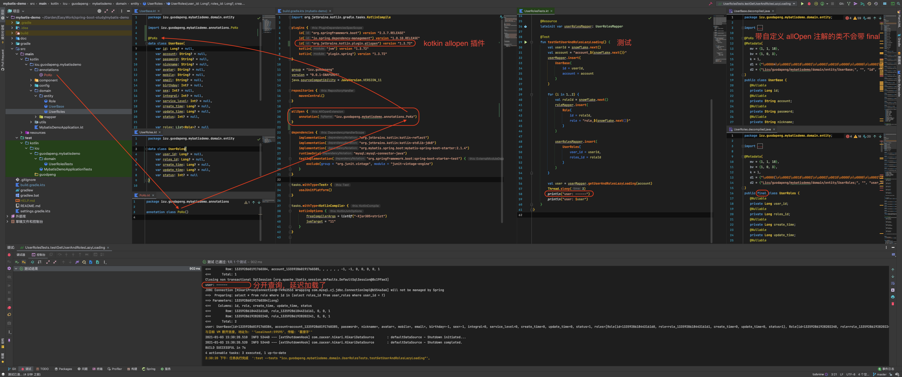

# 工程简介

[Aliyun Java Initializr](https://start.aliyun.com/bootstrap.html/ed75aa7f8b6f04cf5486877054490440/#!type=gradle-project&language=kotlin&architecture=none&platformVersion=2.3.7.RELEASE&packaging=jar&jvmVersion=11&groupId=icu.guodpeng&artifactId=mybatis-demo&name=mybatis-demo&description=mybatis%20demo%20project%20for%20Spring%20Boot&packageName=icu.guodpeng.mybatisdemo&dependencies=mysql,mybatis)

这是一个测试 mybatis 的项目。

1. 延迟加载出现错误

`application.properties` `lazy-loading-enabled=true` cause an error

```
nested exception is org.apache.ibatis.executor.ExecutorException: Error creating lazy proxy.  Cause: java.lang.RuntimeException: icu.guodapeng.mybatisdemo.domain.entity.UserBase is final
org.mybatis.spring.MyBatisSystemException: nested exception is org.apache.ibatis.executor.ExecutorException: Error creating lazy proxy.  Cause: java.lang.RuntimeException: icu.guodapeng.mybatisdemo.domain.entity.UserBase is final
	at org.mybatis.spring.MyBatisExceptionTranslator.translateExceptionIfPossible(MyBatisExceptionTranslator.java:96)
	at org.mybatis.spring.SqlSessionTemplate$SqlSessionInterceptor.invoke(SqlSessionTemplate.java:441)
	...
```

[Test](./src/test/kotlin/icu/guodapeng/mybatisdemo/domain/UserRolesTests.kt)

解决了方案：使用 kotlin-allopen 插件解决。与 CGLIB 的工作方式有关。



# 延伸阅读

[mybatis](https://mybatis.org/mybatis-3/zh/)

[GitHub mybatis-3](https://github.com/mybatis/mybatis-3)

[About mybatis-spring-boot](http://mybatis.org/spring-boot-starter/)

[GitHub spring-boot-starter](https://github.com/mybatis/spring-boot-starter)

我不认识这个文章的作者，但是受到了他的帮助。

[kotlin 数据类 noarg和allopen插件的使用](https://blog.csdn.net/mp624183768/article/details/106822144/)